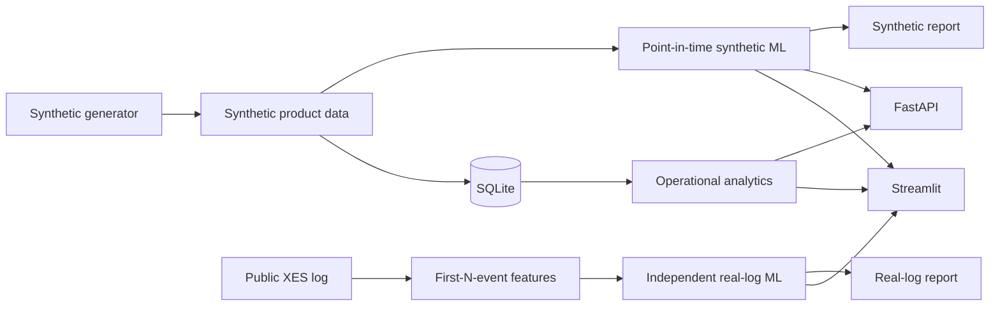

# WorkLens AI

WorkLens is a portfolio-scale workflow-intelligence application combining
process mining, early operational prediction, anomaly review, automation ROI,
a Streamlit product, and a typed FastAPI backend.

It maintains two explicit evidence tracks:

1. **Synthetic healthcare claims = product demonstration.** Deterministic data
   powers the end-to-end dashboard, API, process analytics, and intervention
   workflow. Synthetic model metrics are not real-world claims evidence.
2. **Public real event log = modelling validation.** An independent Sepsis
   Cases experiment tests first-N-event long-case classification and
   remaining-time regression with chronological validation.

This is not a production claims, clinical, fraud, or payment system.

## What is implemented

- Deterministic 50,000-case synthetic event-log generator and small sample mode
- SQLite schema, indexes, operational views, validation, and idempotent rebuild
- Process variants, transitions, bottlenecks, rework, team analytics, and ROI
- Point-in-time feature registry with task-specific leakage enforcement
- Synthetic SLA and completion models using first-five-event and strictly prior
  historical features
- Separate early anomaly risk and retrospective anomaly investigation
- Independent N=3/N=5 public event-log classification/regression experiments
- Temporal 70/15/15 validation, baselines, threshold analysis, calibration,
  Brier score, residual analysis, importance, and local associated drivers
- FastAPI endpoints with strict Pydantic schemas and generated OpenAPI docs
- Streamlit workspaces that label data provenance and handle missing artifacts
- Pytest, coverage enforcement, Ruff, GitHub Actions, Docker Compose, and Make

## Tech stack

Python 3.11, pandas, NumPy, scikit-learn, XGBoost, FastAPI, Pydantic,
Streamlit, Plotly, NetworkX, SQLite/SQLAlchemy, Matplotlib, pytest, Ruff,
Docker Compose, and GitHub Actions.

## Reproducible results

These figures were generated by committed scripts and saved as JSON/Markdown.

### Synthetic product-demo track

On the latest 15% temporal holdout:

| Task | Selected model | Holdout result |
|---|---|---|
| SLA breach | Logistic Regression | Recall 0.934, precision 0.397, ROC-AUC 0.938, PR-AUC 0.661, Brier 0.115 |
| Completion time | Linear Regression | MAE 8.01h, RMSE 13.31h, median AE 4.65h, R² 0.727 |
| Early anomaly | Isolation Forest + observed-prefix rules | 750 of 50,000 cases in the generated review tail |
| Retrospective anomaly | Isolation Forest on completed cases | 750 of 50,000 cases in the generated review tail |

These values demonstrate generator and product behavior only. See
`reports/synthetic_model_report.md`.

### Real public event-log track

The full [Sepsis Cases Event Log](https://data.4tu.nl/articles/_/12707639/1)
contains 1,050 cases and 15,214 events. For the N=3 temporal holdout:

| Task | Selected model | Holdout result |
|---|---|---|
| Validation-selected `long_case_q75`, N=3 | Random Forest | ROC-AUC 0.444, PR-AUC 0.161 vs prevalence 0.171, balanced accuracy 0.495 |
| Secondary `open_after_30_days`, N=5 | Logistic Regression | ROC-AUC 0.586, PR-AUC 0.187 vs prevalence 0.150; diagnostic, not primary |
| Remaining time, N=3 | Median baseline selected | MAE 354.93h, RMSE 788.91h, median AE 129.09h, R² -0.119 |
| Best non-baseline regression by validation | Log1p Ridge | Test MAE 362.21h; did not beat 354.93h median baseline |

The validation-selected primary classifier did not beat prevalence on the
later holdout, and no regression model beat the median baseline. Some secondary
survival-style targets show ranking lift, but they were not selected using test
results and are not presented as operationally useful. The experiment validates
the implementation and exposes its limitations; it does not establish a useful
production model. See
`reports/real_eventlog_model_report.md`.

## Leakage controls

Synthetic prediction occurs after the first five observed events. Real-log
experiments use exactly the first N events. Targets and final-case fields are
joined only after prefix construction.

`src/ml/feature_registry.py` records, for each feature:

- source and prediction stage;
- whether future information is used;
- safety for SLA, remaining-time, early anomaly, and retrospective tasks.

Every synthetic training entry point calls the registry. Real-log training
calls its dedicated prefix guard. Unknown or unsafe fields raise an error.
Tests verify that later events cannot alter early synthetic features.

Real-log historical rate and duration encodings are fitted on the training
window only. Fitting rows use leave-one-out values; unseen validation/test
categories receive training-window defaults.

Early anomaly mode uses intake, prior history, and observed-prefix signals.
Retrospective anomaly mode explicitly uses final duration, cost, and full-path
summaries. API schemas and dashboard labels preserve this distinction.

## Architecture



More detail: `docs/architecture.md`.

## Project structure

```text
app/                         Streamlit app and workspaces
backend/                     FastAPI routes, schemas, and services
database/                    SQLite schema and queries
data/sample/                 Small test/demo samples
data/synthetic/              Generated synthetic artifacts (ignored)
data/real/raw/               Downloaded public log (ignored)
docs/                        Architecture, methods, API, limits, operations
real_eventlog_experiments/   Independent public-log experiment package
reports/                     Reproducible Markdown, JSON/CSV, and figures
scripts/                     Download, validation, and report entry points
src/                         Generator, analytics, process mining, and synthetic ML
tests/                       Unit and integration tests
```

## Setup

Python 3.11 is recommended.

```bash
git clone <repository-url>
cd worklens-ai
make setup
make verify
make check-hygiene
```

Fast sample-path verification:

```bash
make generate-sample-data
make train-sample
make test
make lint
make check-hygiene
```

Full synthetic demo:

```bash
make data
make db
make train
make reports
```

Run Streamlit:

```bash
make run-streamlit
```

Open [http://localhost:8501](http://localhost:8501). If generated artifacts are
missing, pages show the exact setup commands instead of failing.

Run FastAPI:

```bash
make run-api
```

Open [http://localhost:8000/docs](http://localhost:8000/docs).

## Real event-log experiment

The source is:

> Mannhardt, Felix (2016), *Sepsis Cases - Event Log*, Version 1,
> 4TU.ResearchData, DOI
> [10.4121/uuid:915d2bfb-7e84-49ad-a286-dc35f063a460](https://doi.org/10.4121/uuid:915d2bfb-7e84-49ad-a286-dc35f063a460).

Download and verify the official checksum:

```bash
make external-data
make run-real-eventlog-full
```

When network access is unavailable:

```bash
make run-real-eventlog-sample
```

The 35-case sample validates code paths only. It must not be cited as modelling
performance.

## API endpoints

| Method | Endpoint | Purpose |
|---|---|---|
| GET | `/health` | Health |
| POST | `/predict/sla` | Early synthetic SLA risk and associated drivers |
| POST | `/predict/duration` | Early synthetic completion estimate |
| POST | `/predict/anomaly/early` | Prefix-safe anomaly risk |
| POST | `/predict/anomaly/retrospective` | Completed-case investigation |
| GET | `/cases/{case_id}` | Case and event detail |
| GET | `/cases/{case_id}/explanation` | Non-causal associated drivers |
| GET | `/analytics/bottlenecks` | Bottleneck ranking |
| GET | `/analytics/anomalies` | Anomaly review queue |
| GET | `/model/metrics` | Saved model evidence |
| GET | `/model/metadata` | Metadata alias |
| GET | `/model/features/leakage-audit` | Feature governance |

Early request schemas use `extra="forbid"`; final outcomes and unknown fields
return HTTP 422. Full examples: `docs/api.md`.

## Streamlit workspaces

The original synthetic pages remain: executive summary, process map,
bottlenecks, rework, automation, SLA risk, completion time, case explorer, team
analytics, data quality, governed analytics assistant, and simulation. Anomaly
review is now split into early and retrospective modes.

Added governance/evidence pages cover real event-log validation, model
monitoring, leakage audit, and methodology/limitations. Every page states its
data track.

## Testing and quality

```bash
make test
make coverage
make lint
make verify
make check-hygiene
```

Coverage has an 80% enforced floor. CI runs tests with coverage and Ruff. Test
results and measured coverage should be cited only from a current local/CI run,
not from this static README. CI also enforces repository hygiene, clean-setup
imports, and the real-event-log sample experiment.

## Docker

```bash
docker compose up --build
```

- Streamlit: [http://localhost:8501](http://localhost:8501)
- API docs: [http://localhost:8000/docs](http://localhost:8000/docs)

## Artifact policy

Full generated CSVs, raw public logs, SQLite databases, caches, and binary model
artifacts are ignored and removed by `make clean`. Small samples, metric JSON,
generated reports, and their generating scripts are retained. See
`docs/artifact_policy.md`.

## Documentation

- `docs/architecture.md`
- `docs/data_dictionary.md`
- `docs/modeling_methodology.md`
- `docs/leakage_audit.md`
- `docs/api.md`
- `docs/reproducibility.md`
- `docs/limitations.md`
- `docs/productionization_plan.md`
- `docs/interview_guide.md`
- `docs/resume_bullets.md`

## Production boundary

Production use would require governed real claims data, migrations and
incremental ingestion, a versioned feature store/model registry, drift and
quality monitoring, authentication/authorization, audit logs, privacy and
compliance controls, human review, observability, rollback, and controlled
intervention studies. Those requirements are documented, not claimed as
implemented.
