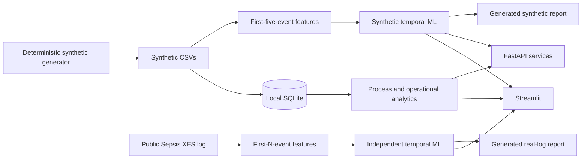

# Architecture

WorkLens is a portfolio-scale modular monolith. The separation is by evidence
track and responsibility, not by unnecessary services.

## Boundaries

- `src/data_generation/`: deterministic synthetic product data.
- `src/analytics/` and `src/process_mining/`: reusable calculations.
- `src/ml/`: synthetic early-prediction and split anomaly pipelines.
- `real_eventlog_experiments/`: independent public-log experiments.
- `backend/`: typed HTTP routes calling services, which call core modules.
- `app/`: Streamlit presentation; no model fitting occurs in pages.
- `database/`: SQLite schema and views for local demonstration.

Generated CSVs, SQLite files, raw public logs, and pickle artifacts are local
runtime outputs. JSON metrics and reports are reproducible evidence artifacts.

